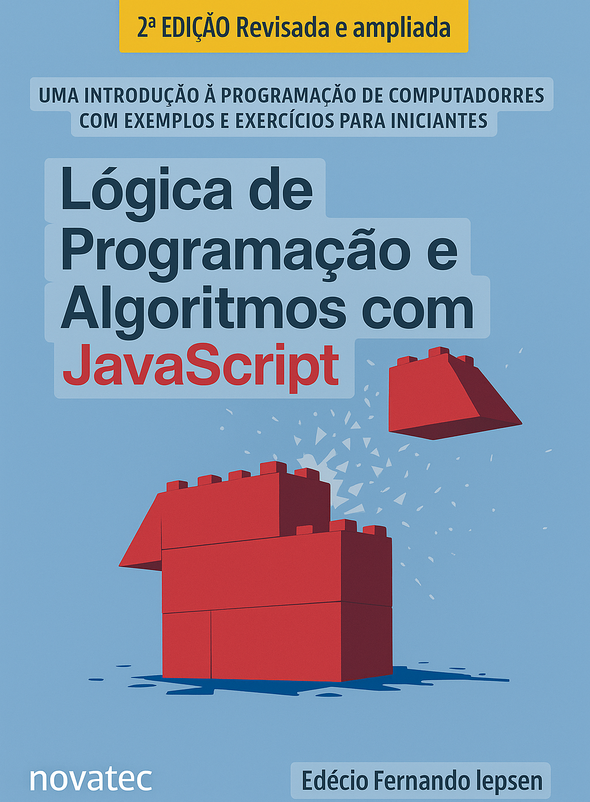
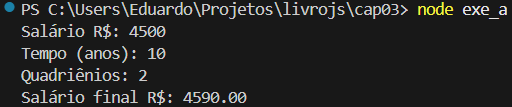
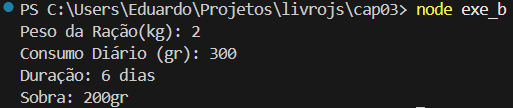

# Livro de Estudo JavaScript

Livro de estudo, utilizando HTML, JavaScript, CSS e NodeJS como ponte entre lógica de programação e aplicações reais.📖

      
    
## ✍️ Descrição 

No terceiro capítulo utilizamos prompt-sync é um pacote do Node.js que permite ler entradas do usuário pelo terminal de forma síncrona. Diferente de outros métodos assíncronos do Node, ele simplifica a interação em programas de linha de comando, funcionando de maneira parecida com a função prompt() do navegador.
      
## 🏃‍♂️Objetivo de Estudo

Criação de programas com Node.JS

1. Código JavaScript do programa Soma 2 Números. (ex3_1 📁)

2. Código JavaScript do programa Revenda. (ex3_2 📁)

  ## 💠Exercícios 

 Elaborar um programa para uma empresa que leia o sálario e o tempo que um funcionario trabalha na empresa. Sabendo que a 4 anos (quadriênio) o funcionario recebe o acréscimo de 1% no salário, calcule e informe o número de quadriênios a que o funcionário tem direito e o salário final. (exe_a 📁)

Elaborar um programa para uma veterinária, leia o peso de uma ração em kg e o quanto o gato consome por dia da ração, em gramas. Informe quantos dias irá durar a ração e o quantos sobra da ração(em gramas). (exercício(b) 📁)

## 🗂 Estrutura do Conteúdo
1. Instalação do Node.js.
2. Adição de pacote para entrada de dados.
3. Criação e execução de programas com o Node.js.
4. Exemplos de algoritmos com Node.js.

## 👨‍💻 Sobre mim
Sou desenvolvedor Front-End apaixonado por criar interfaces modernas e intuitivas.  
Se quiser trocar ideias ou colaborar em um projeto.

## 📲 Contato

[Github](https://github.com/Horvate)
[Linkdin](https://www.linkedin.com/in/eduardo-horvate/)
[Email](https://mail.google.com/mail/u/0/?tab=rm&ogbl#sent)

##  🧔‍♂️Autor e Créditos

Material baseado no livro Lógica de Programação e Algoritmos com JavaScript, de Edécio Fernando Iepsen.

## 📜 Licença

Este material é apenas para fins educacionais e de estudo.# LivroJs-cap1
# LivroJs-cap3